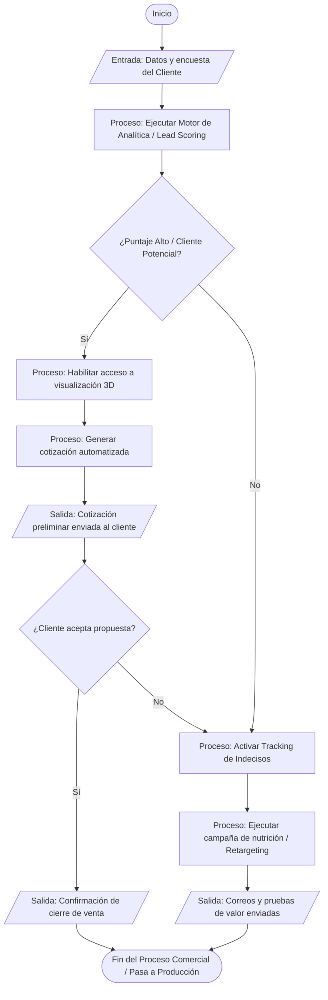
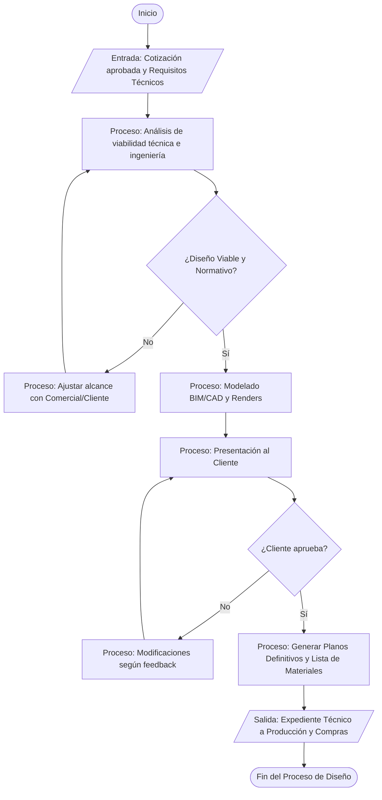

# Mapa de proceso

Aquí almacenamos el codigo fuente de los diagramas de procesos para control de versiones

## MACRO-PROCESO: MISIONAL (CLAVE)

### Gestión Comercial y Ventas

### Planificación y Diseño

