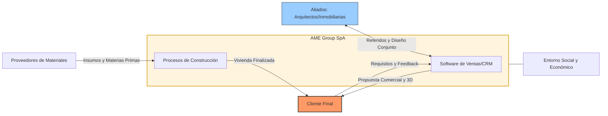
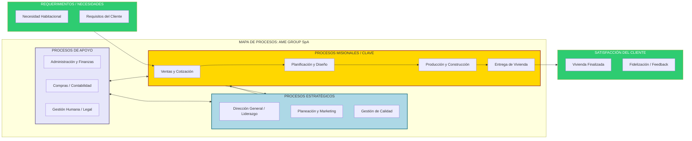

# Gráfica de Relaciones Externas (Ecosistema de Negocio)

Este diagrama posiciona a la constructora en el centro (sistema abierto) y muestra cómo interactúa con el entorno para captar entradas y entregar salidas.

