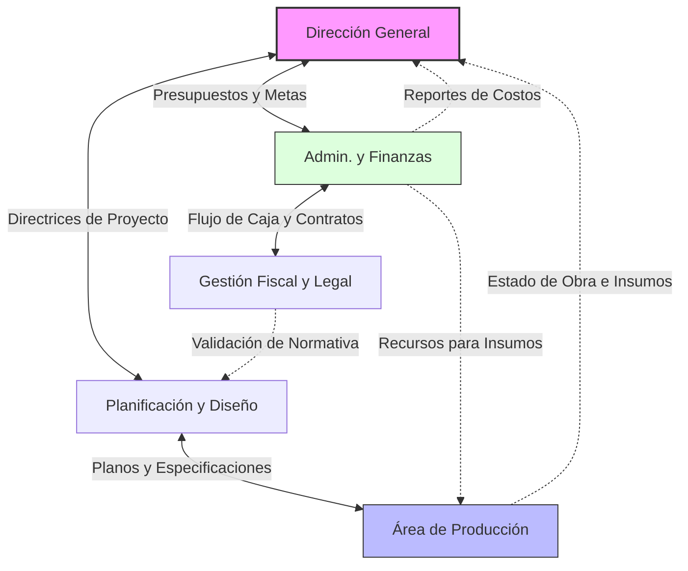

# Gráfica de Relaciones Internas (Diagrama de Red)
Este gráfico muestra la interconexión entre la Dirección General y los subsistemas operativos, destacando la fluidez de la información técnica y financiera.

